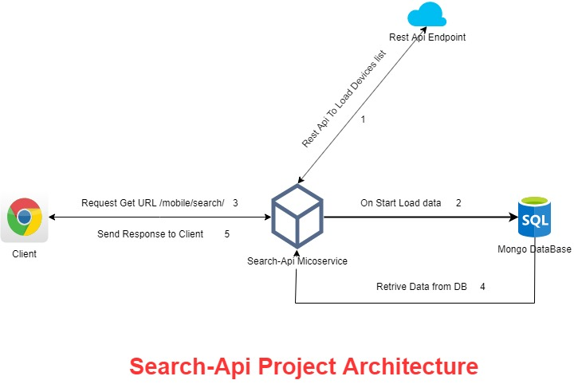

# search-api
Spring Boot Application for finding the mobiles based on search criteria.

# Background : 
In this application we are demonstarting a simple application with search api for searching Mobiles based dynamic Search Criteria which are loaded in MongoDb
on start of application from an external endpoint.

# Tools & Framwework Used:
- Spring Boot 2.x
- Maven 
- MongoDB
- LogBook 
- Logback 
- Junit 5

# Prerequisties
- Jdk 1.8
- Maven 

# Architecture

# Run Instructions

1. Go to Project Directory open command prompt
2. mvn clean install
3. Go to target folder jar is created
4. cmd from target folder : java -jar search-api-1.0.jar

# Coverage Report

